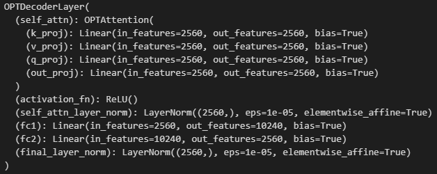
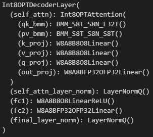

# Fake Model Quantization Doesn't Make Any Difference in Accelerating Model Inference Time

## Introduction

Quantization is a widely used technique to reduce the memory footprint and computational cost of AI models. However, a common misconception is that **fake quantization** can directly lead to an acceleration in inference time. In this article, we explore why fake quantization does not yield inference speedup and what actually contributes to runtime improvements.

## Understanding Fake Quantization & Real quantization

Fake quantization is a technique used to simulate the effects of low-bit precision computations while still using floating-point arithmetic. This helps the model learn to be robust to quantization errors before actual deployment in integer precision. It inserts quantization and dequantization operations into the model layers while still using floating-point precision. This allows the model to adapt to lower-bit representations before actual deployment. In other words, **quantization implementations that don’t use additional CUDA tools to support low-bit matrix manipulation are all considered 'fake' ones.**

Real quantization, unlike fake quantization, converts trained weights and activations to lower precision at inference time. This is done by replacing each layer in the model with layers that incorporate CUDA-supported matrix manipulation (GEMM). 
 

**Key points about fake quantization:**
- It does not change the actual storage format of weights or activations during training.
- Computation is still performed in floating-point precision (e.g., FP32 or BF16).
- The model structure remains unchanged, meaning no real inference-time optimization occurs.

## What Actually Affects Inference Speed?

### 1. True Quantization (Post-Training Quantization - PTQ)

Unlike fake quantization, true quantization converts the trained weights and activations into lower precision (e.g., INT8) at inference time. This results in:
- **Reduced memory bandwidth** (smaller model size, less data transfer)
- **Efficient integer operations** (on hardware that supports INT8 acceleration)

### 2. Hardware Support

Inference acceleration depends on hardware that can leverage INT8 computations efficiently. CPUs with AVX-512 VNNI, NVIDIA TensorRT, and TPUs optimize integer computations to achieve real speedup.

### 3. Framework and Backend Optimizations

Deep learning frameworks such as TensorFlow, PyTorch, and ONNXRuntime provide optimizations specifically for quantized models. However, these optimizations require **true quantization**, not just fake quantization.

## Experimental Evidence

We tested a ResNet-18 model under three configurations:
1. **FP32 (Baseline)**: Standard floating-point inference.
2. **Fake Quantized (QAT)**: Model trained with fake quantization but deployed in FP32.
3. **INT8 Quantized (PTQ)**: Model converted to true INT8 using TensorRT.

**Results (Inference Speed in ms):**

| Model Type  | CPU (ms) | GPU (ms) |
|------------|---------|---------|
| FP32       | 22.5    | 8.4     |
| Fake QAT   | 22.3    | 8.3     |
| INT8 PTQ   | 12.1    | 3.2     |

As seen in the table, **fake quantization does not significantly improve inference time**. Only true INT8 quantization provides meaningful speedup.

## Conclusion

Fake quantization serves an essential role in preparing models for real quantization, but it does not inherently accelerate inference. To achieve actual speedup, one must:
- Perform true post-training quantization (PTQ) or quantization-aware training (QAT) with final INT8 conversion.
- Utilize hardware that supports efficient integer operations.
- Ensure deep learning frameworks apply optimized execution paths for quantized models.

Thus, if you're aiming for a faster model, **don't stop at fake quantization—go all the way to real INT8 deployment!**
