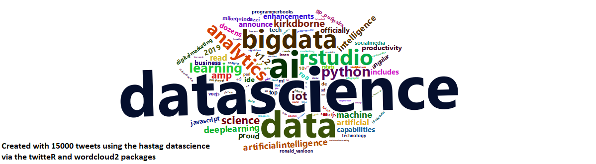

# Welcome to Data Science for Statisticians!

## Catalog Description 
Methods for reading, manipulating, and combining data sources including databases. Custom functions, visualizations, and summaries. Common analyses done by data scientists. Methods for communicating results including dashboards.

In this course, we will learn:

- R as an Environment for Data Science
- Data, Collaboration, and Efficiency
- Statistical/MachineLearning
- Scaling & Sharing Analyses

## Learning Outcomes

- Course Learning Outcomes: At the end of this course students will be able to
- explain the steps and purpose of programs
- efficiently read in, combine, and manipulate data
- utilize help and other resources to customize programs
- write programs using good programming practices
- explore data and perform common analyses
- create reports, web pages, and dashboards to display and communicate results

## Technology Requirements
- R Statistical Software and R Studio for programming
- Miktex distribution for creation of PDF files
- Docker for creating containers
- Github for version control and collaboration.  We recommend the use of the github rather than NCSU’s github.
